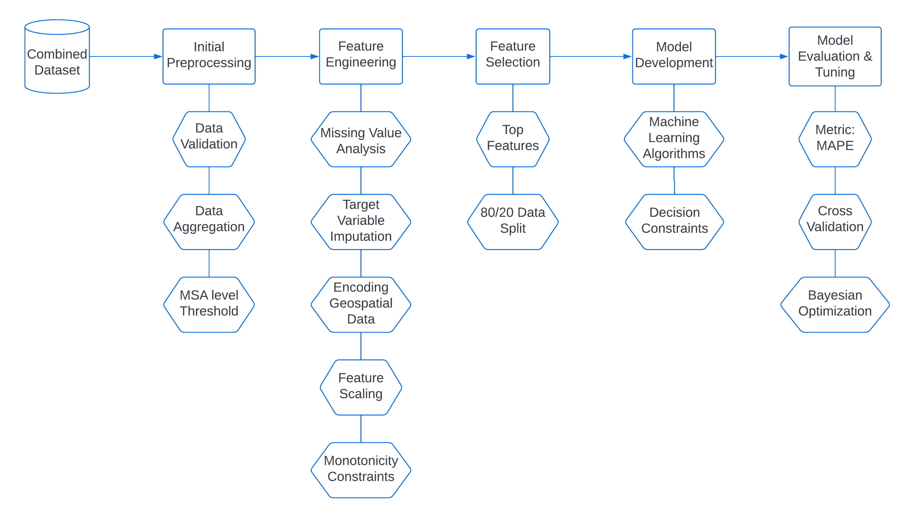

# Prediction of Commercial Insurance Payments for Surgical Procedure using DataRobot

## Business Problem
* Predict the claim amount for MSA (Measurement System Analysis) having less than 10 procedures.
* Validate the results for the DataRobot models.
* Develop a production level Machine Learning Framework for predicting Insurance Payments for surgical procedures. 
* If possible, improve the model performance from the Baseline DataRobot models.
* Models and code to be delivered in Python.

Data Analysis and Prediction of Insurance Cost With the Help of Multiple Machine learning Algorithms and Python Libraries.
This GitHub repository houses a comprehensive insurance cost prediction project developed using Python, machine learning, and advanced algorithms. The primary objective of this project is to leverage historical insurance data and various predictive techniques to estimate the costs associated with insurance coverage accurately.

# Key Features:
### 1.Data preprocessing: 
Implement data cleaning, transformation, and feature engineering techniques to ensure high-quality input data for the predictive models.
### 2.Exploratory data analysis: 
Conduct in-depth exploratory analysis to gain valuable insights into the insurance dataset, uncover patterns, correlations, and identify potential outliers.
### 3.Machine learning models:
Utilize state-of-the-art machine learning algorithms, such as linear regression, decision trees, random forests, gradient boosting, or neural networks, to develop robust predictive models.
### 4.Model training and evaluation: 
Split the dataset into training and testing sets, train the models on the training data, and evaluate their performance using appropriate metrics like mean absolute error, root mean square error, or R-squared.
### 5.Hyperparameter tuning: 
Fine-tune the models by optimizing hyperparameters using techniques like grid search, random search, or Bayesian optimization to enhance predictive accuracy.
### 6.Model comparison: 
Conduct a comparative analysis of multiple models to determine the most effective algorithm for insurance cost prediction.
### 7.Deployment: 
Provide a deployment framework, either through web-based interfaces or APIs, allowing users to input relevant information and receive accurate insurance cost predictions.
### 8.Documentation: 
Include detailed documentation and explanations of the codebase, project structure, and key methodologies to facilitate easy understanding and usage.
This repository serves as a comprehensive resource for insurance professionals, data scientists, and enthusiasts interested in insurance cost prediction. It provides a solid foundation for further research, experimentation, and the development of advanced models in the domain of insurance analytics.

## Languages and Tools

  

## Project Structure and Approach Outline

## Documentation
[Technical Report](https://github.com/partha2022/insurance-management-system/blob/main/docs/Capstone_Final%20_Project_Notes%20Report_Parthasarathi.pdf)

## Instructions for Project Setup
Please run the following jupyter notebooks in sequence:
1. Run the `Final Code Snippet/Capstone_Step1_Data_Preprocessing.ipynb` notebook responsible for transforming raw datasets into a preprocessed dataset. Please edit the file paths to `data/raw` folder.
2. Afterwards, run `Final Code Snippet/Capstone_Step2_Data_Modelling.ipynb`responsible for performing data modelling and model evaluation.
3. Run `Final Code Snippet/Capstone_Step3_XGBoost_Model.ipynb`responsible for XGBoost modelling and enforcing the monotonicity constraints. Please ensure that output of Step 1 and Step 2 has been generated before running Step 3.

## Credits

### Authors
- Parthasarathi Swain

[1]: https://img.shields.io/travis/yoshuawuyts/github-standard-labels/master.svg?style=flat-square
[2]: https://travis-ci.org/yoshuawuyts/github-standard-labels
